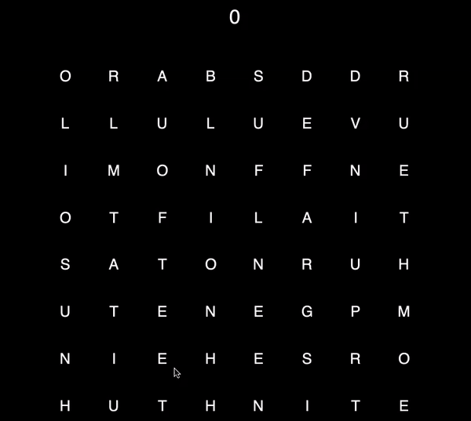

# WordFinder 

Combine tiles on the board to form words! Aim for a new high score by making longer words! 

## How to play

As a player, create words by clicking through a path of letter tiles: you can go in any direction adjacent touching a tile, but cannot use tiles already within the path. You can de-select the last tile selected by reclicking it. If your path did not form a valid word, clicking outside of the board space will de-select all tiles within your path. If it did, clicking outside will update the score with the word your path formed; the tiles within your path are then reset with different tiles. Don't worry, the game is guaranteed to always have available words on the board! 

## Setup
Download all the .py files and word_dictionary.txt into the same directory. Play the game by running game.py from the console. 

## How it works

The 8-by-8 board is first initialized with a selection of random words and commonly appearing letters. After you select a word and the tiles you used reset, a depth-first search algorithm tests random letters on those reset tiles, choosing the first one which guarantees valid word combinations with its surrounding tiles. 
